# VLM OCR Pipeline

A unified OCR processing pipeline that leverages Vision Language Models (VLMs) for document layout detection, text extraction, and AI-powered text correction. This system processes images and PDFs locally using multiple VLM backends (OpenAI/OpenRouter, Gemini).

> **Based on**: This project is based on and modified from [Versatile-OCR-Program](https://github.com/ses4255/Versatile-OCR-Program)

## 📚 Documentation

**[📖 Full Documentation](https://nounique.github.io/vlm-ocr-pipeline/)** (once GitHub Pages is enabled)

Quick links:
- [Installation Guide](https://nounique.github.io/vlm-ocr-pipeline/getting-started/installation/)
- [Quick Start](https://nounique.github.io/vlm-ocr-pipeline/getting-started/quickstart/)
- [Architecture Overview](https://nounique.github.io/vlm-ocr-pipeline/architecture/overview/)
- [API Reference](https://nounique.github.io/vlm-ocr-pipeline/api/pipeline/)
- [Contributing Guide](https://nounique.github.io/vlm-ocr-pipeline/guides/contributing/)

Local documentation:
```bash
# Serve documentation locally
uv run mkdocs serve
# Visit http://127.0.0.1:8000
```

## Features

- **Document Layout Detection**: Automatically detects text, tables, figures, and other elements using DocLayout-YOLO, PaddleOCR PP-DocLayoutV2, or MinerU
- **Multi-VLM Backend Support**: Support for OpenAI, OpenRouter, and Gemini VLM APIs for text extraction and processing
- **Local VLM Recognition**: PaddleOCR-VL-0.9B (NaViT + ERNIE-4.5-0.3B, 109 languages) and DeepSeek-OCR (contextual optical compression)
- **Modular Detection & Ordering**: Flexible detector and sorter combinations (DocLayout-YOLO, PaddleOCR, MinerU, olmOCR)
- **Advanced Ordering Algorithms**: Support for multi-column, LayoutReader (LayoutLMv3), XY-Cut, and VLM-based ordering
- **Unified BBox System**: Integer-based bounding box (internal: xyxy, JSON: xywh) with automatic conversion between 6+ different formats (YOLO, MinerU, PyMuPDF, PyPDF, olmOCR)
- **VLM-Powered Text Extraction**: Advanced text extraction using Vision Language Models with intelligent context understanding
- **Multi-Language Support**: Supports English, Korean, Japanese, and 109+ languages (PaddleOCR-VL)
- **AI-Powered Correction**: Intelligent text correction and content analysis
- **Special Content Processing**: Enhanced analysis of tables and figures with structured output
- **Model-Specific Prompts**: YAML-based prompt templates organized by model family for optimal results
- **Local & Cloud Processing**: Choose between local models (PaddleOCR-VL) or cloud APIs (OpenAI, Gemini)
- **Caching System**: Intelligent caching to avoid reprocessing identical content
- **Smart Resume**: Automatic checkpoint/resume system - resumes from last successful page after interruption
- **Flexible Input**: Supports single images, PDFs, or batch processing of directories

## Project Structure

```
vlm-ocr-pipeline/
├── main.py                     # CLI entry point
├── pipeline/                   # Modular VLM OCR Pipeline
│   ├── __init__.py            # Main Pipeline class
│   ├── types.py               # Integer-based BBox and Block types
│   ├── constants.py
│   ├── misc.py
│   ├── prompt.py
│   │
│   ├── stages/                # 8-stage pipeline architecture
│   │   ├── __init__.py
│   │   ├── input_stage.py     # Stage 1: Document loading & auxiliary info
│   │   ├── detection_stage.py # Stage 2: Layout block detection
│   │   ├── ordering_stage.py  # Stage 3: Reading order analysis
│   │   ├── recognition_stage.py # Stage 4: Text extraction from blocks
│   │   ├── block_correction_stage.py # Stage 5: Block-level correction
│   │   ├── rendering_stage.py # Stage 6: Markdown/plaintext conversion
│   │   ├── page_correction_stage.py # Stage 7: Page-level VLM correction
│   │   └── output_stage.py    # Stage 8: Result saving & summary
│   │
│   ├── layout/
│   │   ├── detection/         # Layout detection strategies
│   │   │   ├── __init__.py    # create_detector()
│   │   │   ├── doclayout_yolo.py  # This project's DocLayout-YOLO
│   │   │   ├── paddleocr/     # PaddleOCR detectors
│   │   │   │   └── detector.py  # PP-DocLayoutV2
│   │   │   └── mineru/        # MinerU detectors
│   │   │       ├── doclayout_yolo.py  # MinerU's DocLayout-YOLO
│   │   │       └── vlm.py     # MinerU VLM
│   │   │
│   │   └── ordering/          # Reading order strategies
│   │       ├── __init__.py    # create_sorter(), validate_combination()
│   │       ├── pymupdf/       # PyMuPDF sorters
│   │       │   └── multi_column.py  # Multi-column detection & sorting
│   │       ├── mineru/        # MinerU sorters
│   │       │   ├── layoutreader.py  # LayoutLMv3
│   │       │   ├── xycut.py   # XY-Cut algorithm
│   │       │   └── vlm.py     # VLM ordering
│   │       └── olmocr/        # olmOCR sorters
│   │           └── vlm.py     # VLM ordering
│   │
│   ├── conversion/            # PDF/Image conversion
│   │   └── converter.py
│   │
│   ├── checkpoint/            # Smart resume functionality
│   │   ├── __init__.py
│   │   ├── progress.py        # ProgressTracker for state management
│   │   └── serializer.py      # JSON serialization for checkpoints
│   │
│   └── recognition/           # Text recognition and correction
│       ├── __init__.py        # TextRecognizer
│       ├── cache.py
│       ├── paddleocr/         # PaddleOCR recognizers
│       │   └── paddleocr_vl.py  # PaddleOCR-VL-0.9B
│       ├── deepseek/          # DeepSeek-OCR recognizers
│       │   └── deepseek_ocr.py  # DeepSeek-OCR
│       └── api/               # VLM API clients (OpenAI, Gemini)
│
├── models/
│   └── doclayout_yolo.py      # DocLayout-YOLO wrapper
│
├── external/                  # External frameworks (git submodules)
│   ├── MinerU/                # MinerU 2.5
│   ├── olmocr/                # olmOCR
│   ├── PaddleOCR/             # PaddleOCR v3.3.0 (PP-DocLayoutV2)
│   ├── PaddleX/               # PaddleX v3.3.1 (PaddleOCR-VL-0.9B)
│   └── DeepSeek-OCR/          # DeepSeek-OCR (contextual optical compression)
│
├── settings/
│   └── prompts/               # YAML prompt templates by model
│
├── tests/                     # Unit tests
├── requirements.txt
├── README.md                  # This file
├── BBOX_FORMATS.md            # BBox format reference
│
├── .tmp/                      # Temporary files (auto-created)
├── .cache/                    # Recognition cache (auto-created)
├── .logs/                     # Log files (auto-created)
└── output/                    # Processing results (auto-created)
```

## Pipeline Architecture

The VLM OCR Pipeline uses a **8-stage architecture** for document processing. Each stage has a clear responsibility and can be independently tested and modified.

```mermaid
graph TD
    A[📄 Input Stage] --> B[🔍 Detection Stage]
    B --> C[📊 Ordering Stage]
    C --> D[📝 Recognition Stage]
    D --> E[✏️ Block Correction Stage]
    E --> F[📋 Rendering Stage]
    F --> G[🔧 Page Correction Stage]
    G --> H[💾 Output Stage]

    A -->|PDF/Image| A1[Load document<br/>Extract auxiliary info]
    B -->|numpy array| B1[Detect layout blocks<br/>bbox, type, confidence]
    C -->|blocks list| C1[Sort by reading order<br/>Add order & column_index]
    D -->|sorted blocks| D1[Extract text from blocks<br/>VLM or local model]
    E -->|blocks with text| E1[Block-level correction<br/>Optional, disabled by default]
    F -->|corrected blocks| F1[Convert to Markdown<br/>or plaintext]
    G -->|raw text| G1[Page-level VLM correction<br/>Improve overall quality]
    H -->|corrected text| H1[Save Page object<br/>Generate summary]

    style A fill:#e1f5ff
    style B fill:#fff3e1
    style C fill:#e8f5e9
    style D fill:#f3e5f5
    style E fill:#fce4ec
    style F fill:#fff9e1
    style G fill:#e0f2f1
    style H fill:#f1f8e9
```



### Stage Details

1. **Input Stage** (`InputStage`)
   - Loads PDF pages or images as numpy arrays
   - Extracts auxiliary information (text spans with font metadata for pymupdf4llm-style markdown)
   - Handles both PDF rendering and direct image loading

2. **Detection Stage** (`DetectionStage`)
   - Detects layout blocks using selected detector (DocLayout-YOLO, PaddleOCR, MinerU)
   - Returns blocks with bounding boxes, types, and confidence scores
   - Extracts column layout information if available

3. **Ordering Stage** (`OrderingStage`)
   - Analyzes reading order using selected sorter (PyMuPDF, LayoutReader, XY-Cut, VLM)
   - Adds `order` field to blocks for correct reading sequence
   - Optionally adds `column_index` for multi-column documents

4. **Recognition Stage** (`RecognitionStage`)
   - Extracts text from each block using VLM or local model
   - Supports multiple backends: OpenAI, Gemini, PaddleOCR-VL, DeepSeek-OCR
   - Handles special content types (tables, figures) with appropriate prompts

5. **Block Correction Stage** (`BlockCorrectionStage`)
   - Block-level text correction (currently a placeholder, disabled by default)
   - Future: VLM-based correction at individual block level
   - Currently just copies `text` to `corrected_text`

6. **Rendering Stage** (`RenderingStage`)
   - Converts processed blocks to output format (Markdown or plaintext)
   - Supports multiple rendering strategies (region-based, font-based)
   - Uses auxiliary info for enhanced markdown conversion

7. **Page Correction Stage** (`PageCorrectionStage`)
   - Page-level text correction using VLM
   - Analyzes and corrects the entire page text for consistency
   - Calculates correction ratio and handles rate limits
   - Skipped for local models (PaddleOCR-VL)

8. **Output Stage** (`OutputStage`)
   - Builds `Page` objects with all metadata
   - Saves page results as JSON files
   - Generates document-level summaries
   - Creates final output structure

### Pipeline Flow Example

```python
# Each stage processes data sequentially using unified process() method
page_image = input_stage.load_pdf_page(pdf_path, page_num)
blocks = detection_stage.process(page_image)
sorted_blocks = ordering_stage.process(blocks, image=page_image)
processed_blocks = recognition_stage.process(sorted_blocks, image=page_image)
processed_blocks = block_correction_stage.process(processed_blocks)  # Optional, disabled by default
text = rendering_stage.process(processed_blocks, auxiliary_info=auxiliary_info)
result = page_correction_stage.process(text, page_num=page_num)  # Optional, disabled by default
page_result = output_stage.build_page_result(...)
output_stage.save_page_output(output_dir, page_num, page_result)
```

## BBox Format Reference

This project integrates multiple frameworks (DocLayout-YOLO, MinerU, PyMuPDF, PyPDF, olmOCR), each using different bounding box formats. We provide a **unified BBox conversion system** that handles all formats automatically.

### **Coordinate Systems**

| Framework | Format | Coordinate Order | Origin | Example |
|-----------|--------|------------------|--------|---------|
| **Current Project (Internal)** | `BBox(x0, y0, x1, y1)` | Top-Left + Bottom-Right (int) | Top-Left (0,0) | `BBox(100, 50, 300, 200)` |
| **Current Project (JSON)** | `[x, y, w, h]` | Top-Left + Size | Top-Left (0,0) | `[100, 50, 200, 150]` |
| **YOLO** | `[x1, y1, x2, y2]` | Top-Left + Bottom-Right | Top-Left (0,0) | `[100, 50, 300, 200]` |
| **MinerU** | `[x0, y0, x1, y1]` | Top-Left + Bottom-Right | Top-Left (0,0) | `[100, 50, 300, 200]` |
| **PyMuPDF** | `Rect(x0, y0, x1, y1)` | Top-Left + Bottom-Right | Top-Left (0,0) | `Rect(100, 50, 300, 200)` |
| **PyPDF** ⚠️ | `[x0, y0, x1, y1]` | **Bottom-Left + Top-Right** ⚠️ | **Bottom-Left (0,0)** ⚠️ | `[100, 592, 300, 742]` |
| **olmOCR** | `"[x, y]text"` | Text format | Top-Left (0,0) | `"[100x50]Chapter 1"` |

**Key Points:**
- ✅ **Internal representation**: `BBox(x0, y0, x1, y1)` with integer coordinates (xyxy)
- ✅ **JSON output**: `[x, y, w, h]` (xywh) for human readability
- ✅ Most frameworks use **Top-Left origin** (like images)
- ⚠️ **PyPDF uses Bottom-Left origin** (traditional PDF coordinate system)
- 📦 Our **BBox class** handles all conversions automatically

**Example Conversion:**
```python
from pipeline.types import BBox, Region

# Create bbox (accepts float, converts to int)
bbox = BBox.from_xywh(100, 50, 200, 150)  # [x, y, w, h] → BBox(100, 50, 300, 200)
bbox = BBox.from_xyxy(100, 50, 300, 200)  # [x0, y0, x1, y1] → BBox(100, 50, 300, 200)
bbox = BBox.from_cxcywh(200, 125, 200, 150)  # Center format

# Internal: integer xyxy
print(bbox.x0, bbox.y0, bbox.x1, bbox.y1)  # 100 50 300 200

# Convert to formats
mineru = bbox.to_mineru_bbox()      # [100, 50, 300, 200] (xyxy)
json_bbox = bbox.to_xywh_list()     # [100, 50, 200, 150] (xywh for JSON)
anchor = bbox.to_olmocr_anchor("image")  # "[Image 100x50 to 300x200]"

# Direct image cropping
cropped = bbox.crop(image, padding=5)

# Region usage
region = Region(type="text", bbox=bbox, confidence=0.95)
data = region.to_dict()  # {"type": "text", "bbox": [100, 50, 200, 150], ...}
```

For detailed format specifications and conversion examples, see [BBOX_FORMATS.md](BBOX_FORMATS.md).

---

## Installation

### 1. Python Environment Setup

```bash
# Clone or download the project
cd vlm-ocr-pipeline

# Create virtual environment (recommended with Python 3.11 for best compatibility)
uv venv --python 3.11 .venv
source .venv/bin/activate  # On Windows: .venv\Scripts\activate

# Install dependencies
uv pip install -r requirements.txt

 Run setup script to fix DocLayout-YOLO compatibility issues
python setup.py
```

### 2. Gemini API Setup (Required)

#### Step 1: Get Gemini API Key

1. Go to [Google AI Studio](https://aistudio.google.com/app/apikey)
2. Sign in with your Google account
3. Click **"Create API Key"**
4. Copy the generated key
5. Set environment variable:

```bash
export GEMINI_API_KEY="your_api_key_here"
```

### What are Vision Language Models (VLMs)?

Vision Language Models are advanced AI systems that can understand both visual and textual information simultaneously. Unlike traditional OCR that simply extracts text, VLMs can:

- **Understand context**: Analyze the relationship between text and visual elements
- **Intelligent text correction**: Fix OCR errors based on contextual understanding  
- **Content analysis**: Describe images, analyze tables, and extract meaningful insights
- **Multi-modal reasoning**: Combine visual and textual information for better results

Popular VLMs supported by this pipeline include:
- **GPT-4 Vision (OpenAI)**: Industry-leading multimodal capabilities
- **Gemini Vision (Google)**: Advanced visual understanding and reasoning
- **Claude Vision (Anthropic)**: Strong analytical and reasoning capabilities

### 3. OpenAI/OpenRouter API Setup

For OpenAI backend:

1. Visit [OpenAI API](https://platform.openai.com/api-keys)
2. Create an API key
3. Set environment variable:

```bash
export OPENAI_API_KEY="your_openai_api_key_here"
```

For OpenRouter backend (supports multiple models including Gemini):

1. Visit [OpenRouter](https://openrouter.ai/keys)
2. Create an API key
3. Set environment variable:

```bash
export OPENROUTER_API_KEY="your_openrouter_api_key_here"
```

### 4. Environment Configuration

Create a `.env` file in the project root:

```env
# Choose your preferred backend (openai is default)
GEMINI_API_KEY=your_gemini_api_key_here
OPENAI_API_KEY=your_openai_api_key_here
OPENROUTER_API_KEY=your_openrouter_api_key_here

# Optional: Custom OpenAI base URL (for OpenRouter or other compatible services)
# OPENAI_BASE_URL=https://openrouter.ai/api/v1
```

## Configuration

VLM OCR Pipeline uses YAML configuration files in the `settings/` directory to customize behavior without modifying code.

### Configuration Files

All configuration files are in `settings/`:

- **`models.yaml`**: Default model paths (e.g., `opendatalab/MinerU2.5-2509-1.2B` for mineru-vlm detector)
- **`detection_config.yaml`**: Detector parameters
  - `confidence_threshold`: Detection sensitivity (0.0-1.0, default: 0.5)
  - `nms_threshold`: Non-Maximum Suppression for overlapping boxes (default: 0.45)
- **`ordering_config.yaml`**: Sorter parameters
  - `overlap_threshold`: IoU threshold for duplicate removal (default: 0.7)
  - `temperature`, `max_new_tokens`: VLM sorter settings
- **`api_config.yaml`**: API client parameters
  - `max_tokens`: Response length limit (default: 2000)
  - `temperature`: Sampling temperature (0.0 = deterministic, default: 0.1)
  - `estimated_tokens`: For Gemini rate limiting

### Examples

**Adjust detection sensitivity**:
```yaml
# settings/detection_config.yaml
detectors:
  doclayout-yolo:
    confidence_threshold: 0.7  # Stricter (default: 0.5)
```

**Customize API parameters**:
```yaml
# settings/api_config.yaml
openai:
  text_extraction:
    max_tokens: 3000      # Longer responses (default: 2000)
    temperature: 0.0      # Fully deterministic (default: 0.1)
```

### Configuration Priority

1. **Explicit parameters** (highest) - passed directly to functions/CLI
2. **YAML configuration files** - loaded from `settings/`
3. **Hardcoded constants** (fallback) - in `pipeline/constants.py`

Missing configuration files automatically fall back to safe defaults with a warning.

## Backend System

The pipeline supports flexible inference backends for each processing stage (detector, sorter, recognizer). Backends can be auto-selected or explicitly specified for performance optimization.

### Available Backends

| Backend | Description | Use Cases |
|---------|-------------|-----------|
| `pytorch` | Native PyTorch inference (single GPU) | DocLayout-YOLO, PaddleOCR models |
| `hf` | HuggingFace Transformers (single GPU) | MinerU VLM, olmOCR, LayoutReader |
| `vllm` | vLLM inference engine (high-throughput) | MinerU VLM, olmOCR, PaddleOCR-VL |
| `sglang` | SGLang inference engine (structured generation) | PaddleOCR-VL |
| `openai` | OpenAI API | GPT-4o, GPT-4 Turbo, GPT-3.5 Turbo |
| `gemini` | Google Gemini API | Gemini 2.5 Flash, Gemini 2.0 Pro |

### Backend Selection

**Auto-selection (recommended)**:
```bash
# Backends are automatically selected based on model capabilities
python main.py --input document.pdf --detector mineru-vlm --recognizer gpt-4o
# detector backend: hf (HuggingFace Transformers)
# recognizer backend: openai (OpenAI API)
```

**Explicit backend specification**:
```bash
# Specify backends for performance tuning
python main.py --input document.pdf \
    --detector mineru-vlm --detector-backend vllm \
    --sorter olmocr-vlm --sorter-backend vllm \
    --recognizer paddleocr-vl --recognizer-backend sglang
```

### Stage-Specific Backends

#### 1. Detector Backends

```bash
# DocLayout-YOLO (PyTorch only)
python main.py --input doc.pdf --detector doclayout-yolo

# MinerU VLM (HuggingFace or vLLM)
python main.py --input doc.pdf --detector mineru-vlm --detector-backend hf
python main.py --input doc.pdf --detector mineru-vlm --detector-backend vllm

# PaddleOCR PP-DocLayoutV2 (PaddlePaddle only)
python main.py --input doc.pdf --detector paddleocr-doclayout-v2
```

#### 2. Sorter Backends

```bash
# Algorithm-based sorters (no backend)
python main.py --input doc.pdf --sorter pymupdf
python main.py --input doc.pdf --sorter mineru-xycut

# olmOCR VLM (HuggingFace or vLLM)
python main.py --input doc.pdf --sorter olmocr-vlm --sorter-backend hf
python main.py --input doc.pdf --sorter olmocr-vlm --sorter-backend vllm
```

#### 3. Recognizer Backends

```bash
# API-based recognizers (OpenAI, Gemini)
python main.py --input doc.pdf --recognizer gpt-4o
python main.py --input doc.pdf --recognizer gemini-2.5-flash

# Local PaddleOCR-VL (PyTorch, vLLM, or SGLang)
python main.py --input doc.pdf --recognizer paddleocr-vl --recognizer-backend pytorch
python main.py --input doc.pdf --recognizer paddleocr-vl --recognizer-backend vllm
python main.py --input doc.pdf --recognizer paddleocr-vl --recognizer-backend sglang

# Local DeepSeek-OCR (HuggingFace or vLLM)
python main.py --input doc.pdf --recognizer deepseek-ocr --recognizer-backend hf
python main.py --input doc.pdf --recognizer deepseek-ocr --recognizer-backend vllm
```

### Backend Compatibility

| Model | Supported Backends | Default |
|-------|-------------------|---------|
| **Detectors** |
| `doclayout-yolo` | (native PyTorch) | - |
| `mineru-doclayout-yolo` | (native PyTorch) | - |
| `mineru-vlm` | `hf`, `vllm` | `hf` |
| `paddleocr-doclayout-v2` | (native PaddlePaddle) | - |
| **Sorters** |
| `pymupdf` | (rule-based) | - |
| `mineru-xycut` | (algorithm-based) | - |
| `mineru-layoutreader` | (HuggingFace Transformers) | - |
| `mineru-vlm` | (uses detector backend) | - |
| `olmocr-vlm` | `hf`, `vllm` | `hf` |
| `paddleocr-doclayout-v2` | (passthrough) | - |
| **Recognizers** |
| `openai` (GPT models) | `openai` | `openai` |
| `gemini` (Gemini models) | `gemini` | `gemini` |
| `paddleocr-vl` | `pytorch`, `vllm`, `sglang` | `pytorch` |
| `deepseek-ocr` | `hf`, `vllm` | `hf` |

For detailed backend configuration, see `settings/models.yaml`.

## Usage

### Command Line Interface

#### Basic Usage

```bash
# Process a single PDF (uses default: paddleocr-doclayout-v2 detector + paddleocr-vl recognizer, balanced DPI)
python main.py --input document.pdf

# Use different recognizer
python main.py --input document.pdf --recognizer deepseek-ocr
python main.py --input document.pdf --recognizer gemini-2.5-flash
python main.py --input document.pdf --recognizer gpt-4o

# Process a directory of PDFs
python main.py --input /path/to/pdfs/

# Process a single image
python main.py --input image.jpg

# Specify custom output directory
python main.py --input document.pdf --output /custom/output/
```

#### Advanced Options

```bash
# Disable caching for fresh processing
python main.py --input document.pdf --no-cache

# Use custom prompts directory (overrides auto-detection)
python main.py --input document.pdf --prompts-dir custom_prompts/

# Backend and model combinations
python main.py --input document.pdf --backend openai --model gpt-4o-mini
python main.py --input document.pdf --backend gemini --model gemini-2.5-flash

# Page limiting options (mutually exclusive)
python main.py --input document.pdf --max-pages 5
python main.py --input document.pdf --page-range 10-20
python main.py --input document.pdf --pages 1,3,5,10,15

# Adjust detection confidence threshold
python main.py --input document.pdf --confidence 0.7

# Use custom model path
python main.py --input document.pdf --model-path /path/to/custom/model.pt

# DPI configuration for PDF-to-image conversion
python main.py --input document.pdf --dpi fast      # 150 DPI - fastest
python main.py --input document.pdf --dpi balanced  # 150→300 dual (recommended)
python main.py --input document.pdf --dpi quality   # 300 DPI - best quality
python main.py --input document.pdf --dpi 200       # Custom single DPI
python main.py --input document.pdf --dpi 150,300   # Custom dual DPI (detection,recognition)

# Enable debug logging
python main.py --input document.pdf --log-level DEBUG

# Text correction options (disabled by default)
python main.py --input document.pdf --block-correction   # Enable block-level VLM correction
python main.py --input document.pdf --page-correction    # Enable page-level VLM correction
python main.py --input document.pdf --block-correction --page-correction  # Enable both

# Combined advanced usage
python main.py --input /docs/ --max-pages 3 --confidence 0.8 --dpi 250
```

#### Modular Detector and Sorter Combinations

```bash
# Use different detector + sorter combinations
python main.py --input document.pdf --detector doclayout-yolo --sorter mineru-xycut

# Use PaddleOCR PP-DocLayoutV2 detector with XY-Cut sorter
python main.py --input document.pdf --detector paddleocr-doclayout-v2 --sorter mineru-xycut

# Use MinerU VLM for both detection and ordering (tightly coupled)
python main.py --input document.pdf --detector mineru-vlm --sorter mineru-vlm \
    --mineru-model opendatalab/PDF-Extract-Kit-1.0

# Use multi-column aware PyMuPDF sorter
python main.py --input document.pdf --detector doclayout-yolo --sorter pymupdf
```

#### Smart Resume (Automatic Checkpointing)

The pipeline automatically saves progress after processing each page. If processing is interrupted (error, Ctrl+C, rate limit), simply re-run the same command and it will automatically resume from where it left off.

```bash
# First run (fails at page 5 due to error or interruption)
python main.py --input document.pdf --output results/
# Creates: results/_progress.json (progress tracker)
#          results/stage6_output_page1.json, page2.json, ... (checkpoints)

# Re-run (automatically resumes from page 5)
python main.py --input document.pdf --output results/
# Reads _progress.json → skips pages 1-4 → continues from page 5

# The system automatically:
# - Detects existing checkpoints in output directory
# - Validates input file matches
# - Skips already-processed pages
# - Displays resume information (last run time, completed stages, etc.)
```

**How it works:**
- `_progress.json` tracks pipeline execution state (completed pages, timestamps, errors)
- Each page is saved as a checkpoint after successful processing
- No CLI arguments needed - always enabled, uses existing `--output` directory
- Checkpoint files are human-readable JSON for easy debugging

#### PaddleOCR End-to-End Pipeline

```bash
# Use PaddleOCR PP-DocLayoutV2 detector + PaddleOCR-VL-0.9B recognizer
# This provides a complete PaddleOCR-based pipeline with 109 language support
python main.py --input document.pdf \
    --detector paddleocr-doclayout-v2 \
    --recognizer paddleocr-vl \
    --sorter mineru-xycut

# With custom backend (vLLM or SGLang for acceleration)
python main.py --input document.pdf \
    --detector paddleocr-doclayout-v2 \
    --recognizer paddleocr-vl \
    --paddleocr-vl-backend vllm-server \
    --sorter mineru-xycut

# With custom query templates for specific block types
python main.py --input document.pdf \
    --detector paddleocr-doclayout-v2 \
    --recognizer paddleocr-vl \
    --paddleocr-vl-query-table "Extract this table in markdown:" \
    --sorter mineru-xycut
```

**Available Detectors:**
- `doclayout-yolo`: This project's DocLayout-YOLO (default)
- `paddleocr-doclayout-v2`: PaddleOCR PP-DocLayoutV2 (25 categories, requires PaddleOCR v3.3.0)
- `mineru-doclayout-yolo`: MinerU's DocLayout-YOLO implementation
- `mineru-vlm`: MinerU VLM-based detection

**Available Recognizers:**
- `openai`: OpenAI VLM backend (default, uses API)
- `gemini`: Gemini VLM backend (uses API)
- `paddleocr-vl`: PaddleOCR-VL-0.9B local model (109 languages, requires PaddleX v3.3.1)

**Available Sorters:**
- `mineru-xycut`: Fast XY-Cut algorithm (default, recommended)
- `pymupdf`: Multi-column aware sorting
- `mineru-layoutreader`: LayoutLMv3-based reading order
- `mineru-vlm`: MinerU VLM-based ordering (requires `mineru-vlm` detector)
- `olmocr-vlm`: olmOCR VLM-based ordering
```

### Python API Usage

```python
from pipeline import Pipeline

# Initialize pipeline with default settings (Gemini API)
pipeline = Pipeline(
    confidence_threshold=0.5,
    use_cache=True,
    cache_dir=".cache",
    output_dir="output"
)

# Process a single image
result = pipeline.process_image("document.jpg")
print(f"Extracted text: {result['corrected_text']}")

# Process a PDF
result = pipeline.process_pdf("document.pdf")
print(f"Processed {result['num_pages']} pages")

# Process PDF with page limits
result = pipeline.process_pdf(
    "document.pdf", 
    max_pages=5  # Process only first 5 pages
)

result = pipeline.process_pdf(
    "document.pdf",
    page_range=(10, 20)  # Process pages 10-20
)

result = pipeline.process_pdf(
    "document.pdf",
    specific_pages=[1, 5, 10, 15]  # Process specific pages
)

# Process a directory
result = pipeline.process_directory("input_folder/")
print(f"Processed {result['total_pdfs']} PDF files")
```

## Output Format

### Single Image/Page Output

Each single image (or individual PDF page) is written as `page_<number>.json` under `<output>/<model>/<document_stem>/`. The payload includes:

- `image_path`: Path to the rendered page image (or original image if supplied)
- `width` / `height`: Pixel dimensions of the rendered page
- `regions`: Raw DocLayout-YOLO detections (bounding boxes and labels)
- `processed_regions`: Post-processed regions with extracted text, table summaries, etc.
- `raw_text`: Natural reading-order text composed from text-like regions
- `corrected_text`: Text after VLM correction (falls back to `raw_text` on failure)
- `correction_confidence`: Similarity score between raw and corrected text (0–1)
- `processing_time_seconds`: Total latency spent on the page
- `processed_at`: ISO-8601 timestamp for when processing completed

```json
{
  "image_path": "output/tmp/document_page_1.jpg",
  "width": 1920,
  "height": 1080,
  "blocks": [...],
  "processed_regions": [...],
  "raw_text": "Original OCR text...",
  "corrected_text": "AI-corrected text...",
  "correction_confidence": 0.95,
  "processing_time_seconds": 12.34,
  "processed_at": "2024-12-19T10:30:00"
}
```

### PDF Summary Output

PDF runs emit a summary file alongside the page outputs: `summary.json` (all pages succeeded), `summary_partial.json` (some failures), or `summary_incomplete.json` (stopped early). The schema captures:

- `pdf_name` / `pdf_path`: Original filename and absolute path
- `num_pages`: Number of pages in the source PDF
- `processed_pages`: Count of pages processed (including fallbacks)
- `output_directory`: Folder that contains per-page and summary JSON artifacts
- `processed_at`: ISO-8601 timestamp for completion
- `status_summary`: Totals of `complete`, `partial`, and `incomplete` pages
- `pages`: Array of page status objects with optional file suffix (e.g., `partial` → `page_2_partial.json`)
- `processing_stopped`: Indicates an early stop due to rate limits or unexpected errors

```json
{
  "pdf_name": "document",
  "pdf_path": "/path/to/document.pdf",
  "num_pages": 10,
  "processed_pages": 10,
  "output_directory": "output/gemini-2.5-flash/document",
  "processed_at": "2024-12-19T10:30:00",
  "status_summary": {"complete": 10},
  "pages": [
    {"page": 1, "status": "complete", "file_suffix": ""},
    {"page": 2, "status": "partial", "file_suffix": "partial"}
  ],
  "processing_stopped": false
}
```

### Markdown Conversion

Convert JSON output to Markdown format using two conversion strategies:

#### 1. Region Type-Based (Default - `__init__.py`)

Simple and fast conversion using pre-classified region types:

```python
from pipeline.conversion.output.markdown import json_to_markdown

regions = [
    {"type": "title", "text": "Document Title"},
    {"type": "subtitle", "text": "Section 1"},
    {"type": "text", "text": "Content here."},
]
md = json_to_markdown(regions)
# # Document Title
#
# ## Section 1
#
# Content here.
```

**Features:**
- ✅ Fast (no PDF processing required)
- ✅ Region type → Markdown header mapping
- ✅ Automatic reading order sorting
- ✅ Special type handling (tables, figures, equations)

#### 2. Font Size-Based (PyMuPDF4LLM Style - `pymupdf4llm.py`)

Advanced conversion using font size information from PDF text spans (PyMuPDF parser):

```python
import json
from pathlib import Path
from pipeline.conversion.output.markdown.pymupdf4llm import to_markdown

# Load page result with auxiliary_info
with open("output/model/document/page_1.json") as f:
    page_result = json.load(f)

# page_result contains:
# {
#   "processed_regions": [...],
#   "auxiliary_info": {
#     "text_spans": [  # PDF text objects with font info
#       {"bbox": [100, 50, 300, 80], "text": "Chapter 1", "size": 24.0, "font": "Times-Bold"}
#     ]
#   }
# }

# Auto-detect headers from font sizes and convert
md = to_markdown(page_result, auto_detect_headers=True)
# # Chapter 1         ← 24pt → H1 (largest)
#
# ## Section 1.1     ← 18pt → H2 (2nd largest)
#
# Body text.         ← 12pt → body text
```

**Key Concepts:**
- 🔄 **Separation of Concerns**: Regions (layout detection) vs Text Spans (PDF parser)
- 📊 **Auxiliary Info**: Font information stored separately in `auxiliary_info.text_spans`
- 🔗 **Late Binding**: Matching happens at conversion time using IoU
- 📖 **PyMuPDF Terminology**: Uses `size` and `font` (not `font_size`, `font_name`)

**How It Works:**

```
1. PDF → Detector → Regions (layout detection from image)
2. PDF → PyMuPDF Parser → Text Spans (font info from digital document)
3. Both saved separately in JSON (auxiliary_info)
4. Markdown conversion → IoU matching → Font-based headers
```

**Comparison:**

| Feature | Region Type-Based | Font Size-Based |
|---------|-------------------|-----------------|
| Speed | ⚡ Fast | 🐌 Slower (PDF parsing) |
| Accuracy | Layout detection dependent | Font size dependent |
| Dependencies | None | PyMuPDF (fitz) |
| Data Source | Region classification | PDF text spans |
| Use Case | Default, quick conversion | Precise header detection |

## Text Extraction

All text extraction is performed by the configured VLM backend (Gemini by default, or OpenAI/OpenRouter if selected). The model receives both rendered page images and prompt instructions tailored to the backend. Rate limiting and caching ensure the pipeline stays within API quotas while avoiding repeated work on identical regions.

## Page Limiting Options

For testing purposes, cost control, or processing specific sections, you can limit which pages to process:

### 1. Maximum Pages (`--max-pages`)
Process only the first N pages from the beginning:
```bash
python main.py --input document.pdf --max-pages 5
```

### 2. Page Range (`--page-range`)
Process a specific range of pages:
```bash
python main.py --input document.pdf --page-range 10-20
python main.py --input document.pdf --page-range 1-5
```

### 3. Specific Pages (`--pages`)
Process only specified pages (comma-separated):
```bash
python main.py --input document.pdf --pages 1,5,10,15
python main.py --input document.pdf --pages 3,7,12
```

### Important Notes
- **Mutually Exclusive**: You can only use one page limiting option at a time
- **1-Indexed**: Page numbers start from 1 (not 0)
- **Directory Mode**: When processing a directory, page limits apply to each PDF individually
- **Invalid Pages**: Invalid page numbers are automatically filtered out with warnings
- **Cost Savings**: Use `--max-pages 1` to test with just the first page before processing entire documents

### Use Cases
- **Testing**: `--max-pages 1` to test pipeline with single page
- **Cost Control**: `--max-pages 10` to limit API calls for large documents
- **Specific Sections**: `--page-range 5-15` to process only content pages
- **Table of Contents**: `--pages 1,2` to process only first few pages
- **Selective Processing**: `--pages 10,25,50` to process sample pages

## Prompt Management

### Model-Specific Prompt System

Prompts are organized by model family for optimal results. The system automatically selects the appropriate prompt directory based on the backend and model:

```
settings/prompts/
├── gemini/                   # Gemini-specific prompts
│   ├── text_extraction.yaml
│   ├── content_analysis.yaml
│   └── text_correction.yaml
├── openai/                   # OpenAI/GPT-specific prompts
│   ├── text_extraction.yaml
│   ├── content_analysis.yaml
│   └── text_correction.yaml
├── internvl/                 # InternVL-specific prompts
├── qwen/                     # Qwen-specific prompts
└── phi4/                     # Phi-4-specific prompts
```

### Automatic Prompt Selection

The system automatically detects the appropriate prompt directory:

- `--backend gemini` → `settings/prompts/gemini/`
- `--backend openai --model gpt-4o` → `settings/prompts/openai/`
- `--backend openai --model google/gemini-2.5-flash` → `settings/prompts/gemini/`
- `--model internvl/internvl2-5` → `settings/prompts/internvl/`

### Customizing Prompts

1. **Copy existing prompts**: `cp -r settings/prompts/gemini custom_prompts`
2. **Edit YAML files**: Modify prompts according to your needs
3. **Use custom prompts**: `python main.py --input doc.pdf --prompts-dir custom_prompts/`

### Prompt Structure

```yaml
# Example: settings/prompts/text_extraction.yaml
text_extraction:
  system: |
    You are an expert OCR system...
  user: |
    Please extract all text from this image...
  fallback: |
    Extract all visible text accurately...
```

### Fallback System
- **First**: Load prompts from YAML files
- **Second**: Use hardcoded fallback prompts
- **Error handling**: Graceful degradation if prompts are missing

## Special Content Processing

### Tables

Tables are automatically detected and processed with structured analysis:

```
[TableStart]

## Table Structure:
| Column1 | Column2 | Column3 |
|---------|---------|---------|
| Data1   | Data2   | Data3   |

## Summary:
Brief description of table content

## Educational Significance:
Importance and context

## Related Topics:
Topic1, Topic2, Topic3

[TableEnd]
```

### Figures

Figures and images receive detailed analysis:

```
[FigureStart]

## Image Description:
Detailed description of visual content

## Educational Significance:
Educational importance

## Related Topics:
Related learning topics

## Exam Relevance:
How this could be used in exams

[FigureEnd]
```

## Free Tier Limits and Cost Management

### Gemini API
- **Free Tier**: Very generous limits
- **Rate Limits**: 15 requests/minute, 1,500 requests/day
- **Cost**: Free for most use cases
- **Optimization**: Enable caching to reduce API calls

### Best Practices for Cost Control

1. **Enable Caching**: Use `--cache` option (default) to avoid reprocessing
2. **Batch Processing**: Process multiple files in one session
3. **Monitor Usage**: Review rate-limit logs and provider dashboards regularly
4. **Set Billing Alerts**: Configure alerts with your API provider to avoid surprises

## Logging

The OCR Pipeline automatically creates detailed log files with timestamps for tracking and debugging.

### Log File Structure

- **Location**: `.logs/` (hidden directory, auto-created)
- **Format**: `YYYY-MM-DD_HH-MM-SS_ocr_pipeline.log`
- **Encoding**: UTF-8 with full Unicode support

### Example Log Files

```
.logs/
├── 2025-07-29_18-06-53_ocr_pipeline.log    # Rate limit status check
├── 2025-07-29_18-07-23_ocr_pipeline.log    # Full OCR processing run
└── 2025-07-29_19-15-42_ocr_pipeline.log    # Another processing session
```

### Log Levels

- **INFO**: General processing information and progress
- **DEBUG**: Detailed debugging information (use `--log-level DEBUG`)
- **WARNING**: Non-critical issues that don't stop processing
- **ERROR**: Critical errors that may stop processing

### Example Usage

```bash
# Standard logging (INFO level)
python main.py --input document.pdf

# Detailed debugging logs
python main.py --input document.pdf --log-level DEBUG

# Minimal logging (ERROR only)
python main.py --input document.pdf --log-level ERROR
```

### Log Cleanup

Log files are automatically organized by timestamp but not automatically deleted. You can:

```bash
# View recent logs
ls -la .logs/

# Remove old logs (older than 7 days)
find .logs/ -name "*.log" -mtime +7 -delete

# Archive logs by month
mkdir -p .logs/archive/2025-07/
mv .logs/2025-07-* .logs/archive/2025-07/
```

## Troubleshooting

### Common Issues

#### "No module named 'models'"
```bash
# Ensure you're in the project root directory
cd gemini_ocr
python main.py --input document.pdf
```

#### "Gemini API client not initialized"
```bash
# Verify environment variable
echo $GEMINI_API_KEY

# Or check .env file
cat .env
```

#### GPU/CUDA Issues
```bash
# Check PyTorch CUDA installation
python -c "import torch; print(torch.cuda.is_available())"

# CPU-only operation is supported if GPU unavailable
```

### Performance Optimization

1. **Use SSD Storage**: For better I/O performance with large PDFs
2. **Increase RAM**: Processing large documents requires sufficient memory
3. **GPU Acceleration**: CUDA-compatible GPU improves DocLayout-YOLO performance
4. **Batch Size**: Process multiple files in sequence for better resource utilization

## Development

### Architecture

The pipeline follows a modular design:

1. **Document Layout Detection**: Uses DocLayout-YOLO to identify regions
2. **Text Extraction**: Gemini or OpenAI/OpenRouter VLM APIs for OCR
3. **Content Analysis**: Gemini/OpenAI APIs for tables and figures
4. **Text Correction**: AI-powered post-processing with the configured VLM
5. **Local Storage**: All results saved locally

### Extending the Pipeline

#### Adding New Region Types

```python
# In ocr_pipeline.py
def _get_gemini_prompt_for_region_type(self, region_type: str) -> str:
    if region_type == 'new_type':
        return "Custom prompt for new region type..."
    # ... existing code
```

#### Custom Post-Processing

```python
# Inherit from Pipeline
class CustomPipeline(Pipeline):
    def _correct_text_with_gemini(self, text: str) -> Dict[str, Any]:
        # Custom correction logic
        return super()._correct_text_with_gemini(text)
```

## License

This project is for educational and research purposes. Please ensure compliance with the respective API provider's terms of service and usage limits.

## Support

For issues and questions:

1. Check the troubleshooting section above
2. Verify API credentials and environment variables (e.g., `GEMINI_API_KEY`, `OPENAI_API_KEY`)
3. Review terminal/log output for detailed error messages
4. Inspect the latest file in `.logs/`

---

**Note**: This system requires internet connectivity for API calls to the selected VLM provider. All processing results are stored locally for privacy and offline access. 
