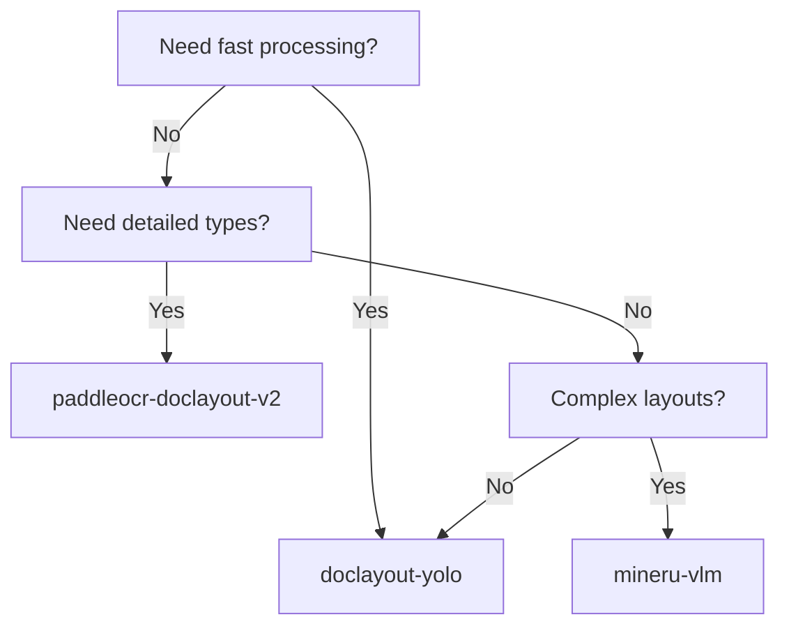

# Detectors

Available layout detection models and their characteristics.

## Overview

Layout detectors identify document regions (text, tables, figures, etc.) in page images. The pipeline supports multiple detector backends with different trade-offs between speed and accuracy.

## Detector Comparison

| Detector | Source | Technology | Speed | Quality | Block Types |
|----------|--------|------------|-------|---------|-------------|
| `doclayout-yolo` | This project | YOLO v8 | ⚡⚡⚡ | ⭐⭐⭐ | 7 |
| `mineru-doclayout-yolo` | MinerU | YOLO v8 | ⚡⚡ | ⭐⭐⭐ | 10 |
| `paddleocr-doclayout-v2` | PaddleOCR | PP-DocLayoutV2 | ⚡⚡ | ⭐⭐⭐⭐ | 25 |
| `mineru-vlm` | MinerU | VLM-based | ⚡ | ⭐⭐⭐⭐ | 25+ |

## DocLayout-YOLO

**Speed**: Fast | **Quality**: Good | **GPU Memory**: ~2GB

This project's optimized DocLayout-YOLO detector based on Ultralytics YOLO v8.

### Block Types

| Type | Description |
|------|-------------|
| `title` | Document titles and headings |
| `plain text` / `text` | Regular paragraph text |
| `figure` | Images and diagrams |
| `table` | Tables |
| `equation` | Mathematical formulas |
| `list` | Bullet/numbered lists |

### Usage

```python
from pipeline.layout.detection import create_detector

detector = create_detector(
    "doclayout-yolo",
    model_path="path/to/model.pt",  # Optional custom model
    confidence_threshold=0.5,
    auto_batch_size=True,  # Auto-optimize batch size
)

blocks = detector.detect(image)
```

### CLI

```bash
python main.py --input doc.pdf --detector doclayout-yolo --confidence 0.5
```

---

## PaddleOCR PP-DocLayoutV2

**Speed**: Medium | **Quality**: Very Good | **GPU Memory**: ~4GB

PaddleOCR's PP-DocLayoutV2 detector with 25 category types and built-in pointer network for reading order.

### Block Types (25 categories)

| Category | Types |
|----------|-------|
| **Titles** | doc_title, paragraph_title |
| **Text** | text, sidebar_text, abstract, contents |
| **References** | reference, reference_content, footnote |
| **Page Elements** | header, footer, header_image, footer_image, page_number |
| **Formulas** | formula, formula_number, algorithm |
| **Tables** | table, table_title |
| **Images** | image, chart, chart_title, seal |

### Usage

```python
detector = create_detector(
    "paddleocr-doclayout-v2",
    confidence_threshold=0.5,
)
```

### CLI

```bash
python main.py --input doc.pdf --detector paddleocr-doclayout-v2
```

### Requirements

- PaddleOCR v3.3.0+ (in `external/PaddleOCR/`)
- PaddlePaddle with CUDA support (recommended)

---

## MinerU DocLayout-YOLO

**Speed**: Fast | **Quality**: Good | **GPU Memory**: ~2GB

MinerU's implementation of DocLayout-YOLO with additional block types.

### Block Types

| Type | Description |
|------|-------------|
| `title` | Document titles |
| `plain text` | Regular text |
| `abandon` | Discarded regions |
| `figure` | Images and diagrams |
| `figure_caption` | Figure captions |
| `table` | Tables |
| `table_caption` | Table captions |
| `table_footnote` | Table footnotes |
| `isolate_formula` | Standalone formulas |
| `formula_caption` | Formula captions |

### Usage

```python
detector = create_detector("mineru-doclayout-yolo")
```

### CLI

```bash
python main.py --input doc.pdf --detector mineru-doclayout-yolo
```

### Requirements

- MinerU 2.5+ (in `external/MinerU/`)

---

## MinerU VLM

**Speed**: Slow | **Quality**: Excellent | **GPU Memory**: ~8GB

Vision Language Model-based detection using MinerU's VLM pipeline.

### Block Types

Full MinerU 2.5 hierarchy with 25+ block types including:

- Content: text, title, list
- Images: image, image_body, image_caption, image_footnote
- Tables: table, table_body, table_caption, table_footnote
- Equations: interline_equation, inline_equation
- Code: code, code_body, code_caption, algorithm
- Page elements: header, footer, page_number, page_footnote
- References: ref_text, phonetic, aside_text, index

### Usage

```python
detector = create_detector(
    "mineru-vlm",
    model_name="opendatalab/MinerU2.5-2509-1.2B",
    backend="hf",  # or "vllm" for faster inference
)
```

### CLI

```bash
python main.py --input doc.pdf --detector mineru-vlm --detector-backend vllm
```

### Requirements

- MinerU 2.5+ (in `external/MinerU/`)
- Large GPU (8GB+ VRAM recommended)

---

## Backend Selection

Detectors can use different inference backends:

| Backend | Description | Supported By |
|---------|-------------|--------------|
| `pytorch` | Native PyTorch | doclayout-yolo, mineru-doclayout-yolo |
| `paddle` | PaddlePaddle | paddleocr-doclayout-v2 |
| `hf` | HuggingFace Transformers | mineru-vlm |
| `vllm` | vLLM high-throughput | mineru-vlm |
| `pt-ray` | PyTorch + Ray multi-GPU | doclayout-yolo |

```bash
# Explicit backend selection
python main.py --input doc.pdf --detector mineru-vlm --detector-backend vllm
```

---

## Choosing a Detector

### Recommended Configurations

| Use Case | Detector | Reason |
|----------|----------|--------|
| **Fast processing** | `doclayout-yolo` | Fastest, good quality |
| **High quality** | `paddleocr-doclayout-v2` | 25 types, built-in ordering |
| **Complex documents** | `mineru-vlm` | Best understanding, slowest |
| **MinerU integration** | `mineru-doclayout-yolo` | MinerU ecosystem |

### Decision Matrix



---

## Performance Benchmarks

Tested on NVIDIA RTX 3090 with 300 DPI images:

| Detector | Pages/min | GPU Memory | Init Time |
|----------|-----------|------------|-----------|
| `doclayout-yolo` | ~60 | 2 GB | 2s |
| `paddleocr-doclayout-v2` | ~40 | 4 GB | 5s |
| `mineru-doclayout-yolo` | ~50 | 2 GB | 3s |
| `mineru-vlm` | ~10 | 8 GB | 30s |

---

## See Also

- [Detection API](../api/detection.md) - API reference
- [Detector Block Types](../guides/detector-block-types.md) - Type mappings
- [Sorters](sorters.md) - Reading order algorithms
