# Architecture Overview

VLM OCR Pipeline is built on a modular, 8-stage architecture that separates concerns and allows flexible configuration of each processing step.

## Core Design Principles

### 1. **Modular Stages**

Each stage has a single responsibility and can be tested independently:

```python
# Each stage is a self-contained module
input_stage = InputStage(...)
detection_stage = DetectionStage(detector)
ordering_stage = OrderingStage(sorter)
recognition_stage = RecognitionStage(recognizer)
```

### 2. **Factory Pattern**

Detectors and sorters are created through factory functions:

```python
# Centralized creation with validation
detector = create_detector("doclayout-yolo")
sorter = create_sorter("mineru-xycut")
validate_combination(detector_name, sorter_name)  # Ensures compatibility
```

### 3. **Protocol-Based Interfaces**

Type-safe plugin system using Python protocols:

```python
class Detector(Protocol):
    """All detectors must implement this interface."""
    def detect(self, image: np.ndarray) -> list[Block]:
        ...

class Sorter(Protocol):
    """All sorters must implement this interface."""
    def sort(self, blocks: list[Block], image: np.ndarray) -> list[Block]:
        ...
```

### 4. **Unified BBox System**

All bounding boxes use the `BBox` dataclass for automatic format conversion:

```python
@dataclass
class BBox:
    x0: int  # Left
    y0: int  # Top
    x1: int  # Right
    y1: int  # Bottom

    # Automatic conversion from 6+ formats
    @classmethod
    def from_yolo(cls, bbox, image_width, image_height) -> BBox:
        ...

    @classmethod
    def from_mineru(cls, bbox) -> BBox:
        ...
```

**Internal**: xyxy (corners)
**JSON Output**: xywh (x, y, width, height)

## 8-Stage Pipeline

```mermaid
graph TD
    A[📄 Stage 1: Input] --> B[🔍 Stage 2: Detection]
    B --> C[📊 Stage 3: Ordering]
    C --> D[📝 Stage 4: Recognition]
    D --> E[✏️ Stage 5: Block Correction]
    E --> F[📋 Stage 6: Rendering]
    F --> G[🔧 Stage 7: Page Correction]
    G --> H[💾 Stage 8: Output]

    style A fill:#e1f5ff
    style B fill:#fff3e1
    style C fill:#e8f5e9
    style D fill:#f3e5f5
    style E fill:#fce4ec
    style F fill:#fff9e1
    style G fill:#e0f2f1
    style H fill:#f1f8e9
```



### Stage 1: Input

**Responsibility**: Load documents and extract auxiliary information

- Renders PDF pages to images (pdf2image)
- Loads image files directly (OpenCV)
- Extracts text spans with font metadata (PyMuPDF)

**Output**: `(image: np.ndarray, auxiliary_info: dict)`

### Stage 2: Detection

**Responsibility**: Detect layout blocks

- Runs selected detector (DocLayout-YOLO, PaddleOCR, MinerU, olmOCR)
- Returns blocks with bounding boxes, types, and confidence scores
- Detects: text, title, table, figure, equation, list

**Output**: `list[Block]` with `bbox`, `type`, `confidence`

### Stage 3: Ordering

**Responsibility**: Analyze reading order

- Runs selected sorter (PyMuPDF, LayoutReader, XY-Cut, VLM)
- Adds `order` field to blocks
- Optionally adds `column_index` for multi-column documents

**Output**: `list[Block]` sorted with `order` field

### Stage 4: Recognition

**Responsibility**: Extract text from blocks

- Crops block images from full page
- Sends to VLM API or local model
- Uses block-type-specific prompts
- Handles special content (tables, figures)

**Output**: `list[Block]` with `text` field populated

### Stage 5: Block Correction

**Responsibility**: Block-level text correction (placeholder)

- Currently disabled by default
- Future: VLM-based correction at block level
- Currently just copies `text` to `corrected_text`

**Output**: `list[Block]` with `corrected_text`

### Stage 6: Rendering

**Responsibility**: Convert to output format

- Assembles blocks in reading order
- Generates Markdown or plaintext
- Uses auxiliary info for enhanced formatting
- Supports multiple rendering strategies

**Output**: `str` (Markdown/plaintext)

### Stage 7: Page Correction

**Responsibility**: Page-level VLM correction

- Sends entire page text to VLM
- Corrects OCR errors and formatting
- Calculates correction ratio
- Handles rate limits
- Skipped for local models

**Output**: `(corrected_text: str, correction_ratio: float, should_stop: bool)`

### Stage 8: Output

**Responsibility**: Save results

- Builds `Page` objects with metadata
- Saves JSON and Markdown files
- Generates document summaries
- Creates output directory structure

**Output**: Saved files in `output/{model}/{document}/`

## Data Flow

### Block Evolution Through Stages

A block's data evolves as it passes through stages:

```python
# After Detection (Stage 2)
Block(
    type="text",
    bbox=BBox(100, 50, 500, 120),
    detection_confidence=0.95,
    source="doclayout-yolo"
)

# After Ordering (Stage 3)
Block(
    type="text",
    bbox=BBox(100, 50, 500, 120),
    detection_confidence=0.95,
    order=0,  # Added
    column_index=0,  # Added (optional)
    source="doclayout-yolo"
)

# After Recognition (Stage 4)
Block(
    type="text",
    bbox=BBox(100, 50, 500, 120),
    detection_confidence=0.95,
    order=0,
    text="Chapter 1: Introduction",  # Added
    source="doclayout-yolo"
)

# After Block Correction (Stage 5)
Block(
    type="text",
    bbox=BBox(100, 50, 500, 120),
    detection_confidence=0.95,
    order=0,
    text="Chapter 1: Introduction",
    corrected_text="Chapter 1: Introduction",  # Added
    source="doclayout-yolo"
)
```

## Extensibility

### Adding a New Detector

1. Implement the `Detector` protocol
2. Register in `create_detector()` factory
3. Add to `validate_combination()` if needed

```python
# pipeline/layout/detection/my_detector.py
class MyDetector:
    def detect(self, image: np.ndarray) -> list[Block]:
        # Your detection logic
        return blocks

# pipeline/layout/detection/__init__.py
def create_detector(name: str, **kwargs) -> Detector:
    if name == "my-detector":
        return MyDetector(**kwargs)
```

### Adding a New Sorter

1. Implement the `Sorter` protocol
2. Register in `create_sorter()` factory
3. Add combination validation

```python
# pipeline/layout/ordering/my_sorter.py
class MySorter:
    def sort(self, blocks: list[Block], image: np.ndarray) -> list[Block]:
        # Your sorting logic
        return sorted_blocks

# pipeline/layout/ordering/__init__.py
def create_sorter(name: str, **kwargs) -> Sorter:
    if name == "my-sorter":
        return MySorter(**kwargs)
```

### Adding a New Recognizer

1. Implement the `Recognizer` protocol
2. Add to TextRecognizer backend selection

```python
class Recognizer(Protocol):
    def process_blocks(self, image: np.ndarray, blocks: Sequence[Block]) -> list[Block]:
        ...

    def correct_text(self, text: str) -> str | dict[str, Any]:
        ...
```

## Error Handling

The pipeline uses a comprehensive error handling system:

- **Custom exceptions**: Specific exception types for different errors
- **Graceful degradation**: Continue processing on non-critical failures
- **Error logging**: Detailed logs with stack traces
- **Rate limit handling**: Automatic retry and backoff

See [Error Handling Guide](../guides/error-handling.md) for details.

## Testing Strategy

Each component can be tested independently:

```python
# Test detector
detector = create_detector("doclayout-yolo")
blocks = detector.detect(test_image)
assert len(blocks) > 0

# Test sorter
sorter = create_sorter("mineru-xycut")
sorted_blocks = sorter.sort(blocks, test_image)
assert sorted_blocks[0].order is not None

# Test full pipeline
pipeline = Pipeline(detector="doclayout-yolo", sorter="mineru-xycut")
result = pipeline.process_single_pdf(test_pdf)
```

## Performance Considerations

### Caching

The recognition stage uses content-based caching:

```python
# Cache key = hash(block_image + block_type + prompt)
cache_key = hashlib.sha256(
    block_image.tobytes() +
    block_type.encode() +
    prompt.encode()
).hexdigest()
```

### Rate Limiting

Gemini API rate limiting is handled globally:

```python
rate_limiter.wait_if_needed(estimated_tokens=1000)
# Automatic throttling based on tier limits
```

### Memory Management

- Block images are deleted after recognition
- Garbage collection is triggered after each block
- Temporary files are cleaned up automatically

## Configuration

Pipeline behavior is controlled through:

1. **CLI Arguments**: Runtime configuration
2. **Environment Variables**: API keys, paths
3. **YAML Files**: Prompts, rate limits
4. **Factory Functions**: Component selection

## Next Steps

- [Pipeline Stages](pipeline-stages.md) - Detailed stage documentation
- [Detectors](detectors.md) - Available detection models
- [Sorters](sorters.md) - Reading order algorithms
- [Recognizers](recognizers.md) - Text extraction backends
