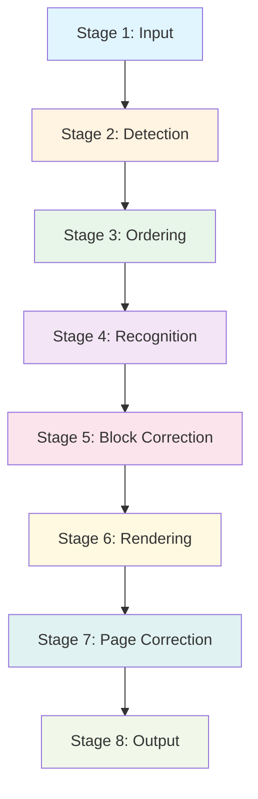

# Pipeline Stages

Detailed documentation for each of the 8 pipeline stages.

For a high-level overview, see [Architecture Overview](overview.md).

## Stage Overview



---

## Stage 1: Input

**File**: `pipeline/stages/input_stage.py`

**Responsibility**: Load documents and extract auxiliary information

### What It Does

- Renders PDF pages to images using pdf2image (configurable DPI)
- Loads image files directly using OpenCV
- Extracts text spans with font metadata from PDFs (PyMuPDF)
- Supports dual resolution mode (lower DPI for detection, higher for recognition)

### Input/Output

| Input | Output |
|-------|--------|
| PDF path + page number | `np.ndarray` (image) |
| Image path | `np.ndarray` (image) |
| PDF path | `dict` (auxiliary_info with text_spans) |

### Key Methods

```python
class InputStage:
    def load_pdf_page(self, pdf_path: Path, page_num: int) -> np.ndarray:
        """Render PDF page to image."""

    def load_image(self, image_path: Path) -> np.ndarray:
        """Load image file."""

    def extract_auxiliary_info(self, pdf_path: Path, page_num: int) -> dict:
        """Extract text spans with font info from PDF."""
```

### Configuration

| Parameter | Default | Description |
|-----------|---------|-------------|
| `dpi` | 200 | Single resolution DPI |
| `detection_dpi` | 150 | Detection DPI (dual mode) |
| `recognition_dpi` | 300 | Recognition DPI (dual mode) |
| `use_dual_resolution` | False | Enable dual resolution mode |

---

## Stage 2: Detection

**File**: `pipeline/stages/detection_stage.py`

**Responsibility**: Detect layout blocks in page images

### What It Does

- Runs selected detector (DocLayout-YOLO, PaddleOCR, MinerU)
- Returns blocks with bounding boxes, types, and confidence scores
- Extracts column layout information if available
- Supports Ray-based distributed detection for multi-GPU

### Input/Output

| Input | Output |
|-------|--------|
| `np.ndarray` (image) | `list[Block]` |

### Block Data After Detection

```python
Block(
    type="text",  # or "title", "table", "image", etc.
    bbox=BBox(100, 50, 500, 120),
    detection_confidence=0.95,
    source="doclayout-yolo",
)
```

### Available Detectors

| Detector | Speed | Quality | Block Types |
|----------|-------|---------|-------------|
| `doclayout-yolo` | Fast | Good | 7 types |
| `paddleocr-doclayout-v2` | Medium | Very Good | 25 types |
| `mineru-doclayout-yolo` | Fast | Good | 10 types |
| `mineru-vlm` | Slow | Excellent | 25+ types |

---

## Stage 3: Ordering

**File**: `pipeline/stages/ordering_stage.py`

**Responsibility**: Analyze reading order of detected blocks

### What It Does

- Runs selected sorter algorithm
- Adds `order` field to blocks for correct reading sequence
- Optionally adds `column_index` for multi-column documents
- Scales bounding boxes if using dual resolution mode

### Input/Output

| Input | Output |
|-------|--------|
| `list[Block]` + image | `list[Block]` (sorted, with `order` field) |

### Block Data After Ordering

```python
Block(
    type="text",
    bbox=BBox(100, 50, 500, 120),
    detection_confidence=0.95,
    order=0,  # Added by sorter
    column_index=0,  # Added by multi-column sorters
    source="doclayout-yolo",
)
```

### Available Sorters

| Sorter | Algorithm | Multi-Column | Speed |
|--------|-----------|--------------|-------|
| `pymupdf` | Font analysis | Yes | Fast |
| `mineru-xycut` | XY-Cut | No | Fast |
| `mineru-layoutreader` | LayoutLMv3 | Yes | Medium |
| `olmocr-vlm` | VLM reasoning | Yes | Slow |

---

## Stage 4: Recognition

**File**: `pipeline/stages/recognition_stage.py`

**Responsibility**: Extract text from each block

### What It Does

- Crops block images from full page using BBox
- Sends cropped images to VLM API or local model
- Uses block-type-specific prompts for optimal results
- Handles special content (tables, figures) with appropriate prompts
- Supports Ray-based distributed recognition

### Input/Output

| Input | Output |
|-------|--------|
| `list[Block]` + image | `list[Block]` (with `text` field) |

### Block Data After Recognition

```python
Block(
    type="text",
    bbox=BBox(100, 50, 500, 120),
    detection_confidence=0.95,
    order=0,
    text="Chapter 1: Introduction",  # Added by recognizer
    source="doclayout-yolo",
)
```

### Available Recognizers

| Recognizer | Type | Cost | Speed |
|------------|------|------|-------|
| `gemini-2.5-flash` | Cloud API | Free tier | Fast |
| `gpt-4o` | Cloud API | Pay per token | Medium |
| `paddleocr-vl` | Local | Free | Medium |
| `deepseek-ocr` | Local | Free | Medium |

---

## Stage 5: Block Correction

**File**: `pipeline/stages/block_correction_stage.py`

**Responsibility**: Block-level text correction (optional)

### What It Does

- Applies VLM-based correction at individual block level
- Currently a placeholder stage (disabled by default)
- Copies `text` to `corrected_text` when disabled

### Input/Output

| Input | Output |
|-------|--------|
| `list[Block]` | `list[Block]` (with `corrected_text` field) |

### Configuration

Enable with `--block-correction` CLI flag or `enable_block_correction=True` in config.

### Block Data After Correction

```python
Block(
    type="text",
    bbox=BBox(100, 50, 500, 120),
    detection_confidence=0.95,
    order=0,
    text="Chapter 1: Introduction",
    corrected_text="Chapter 1: Introduction",  # Added
    source="doclayout-yolo",
)
```

---

## Stage 6: Rendering

**File**: `pipeline/stages/rendering_stage.py`

**Responsibility**: Convert processed blocks to output format

### What It Does

- Assembles blocks in reading order
- Generates Markdown or plaintext output
- Uses auxiliary info (font sizes) for enhanced formatting
- Supports multiple rendering strategies

### Input/Output

| Input | Output |
|-------|--------|
| `list[Block]` + auxiliary_info | `str` (Markdown/plaintext) |

### Rendering Strategies

| Strategy | Description | Use Case |
|----------|-------------|----------|
| Block Type-Based | Maps block types to Markdown | Default, fast |
| Font Size-Based | Uses font sizes for headers | Precise formatting |

### Example Output

```markdown
# Chapter 1: Introduction

This document describes the VLM OCR Pipeline...

## Key Features

- Feature 1
- Feature 2
```

---

## Stage 7: Page Correction

**File**: `pipeline/stages/page_correction_stage.py`

**Responsibility**: Page-level VLM correction (optional)

### What It Does

- Sends entire page text to VLM for holistic correction
- Corrects OCR errors and improves formatting consistency
- Calculates correction ratio (how much text changed)
- Handles rate limits and returns early if needed

### Input/Output

| Input | Output |
|-------|--------|
| `str` (page text) | `PageCorrectionResult` |

### PageCorrectionResult

```python
@dataclass
class PageCorrectionResult:
    corrected_text: str
    correction_ratio: float  # 0.0 = no change, 1.0 = completely different
    should_stop: bool  # True if rate limit hit
```

### Configuration

- Enable with `--page-correction` CLI flag
- Skipped for local models (PaddleOCR-VL) by default
- Controlled by `enable_page_correction=True` in config

---

## Stage 8: Output

**File**: `pipeline/stages/output_stage.py`

**Responsibility**: Save results and generate summaries

### What It Does

- Builds `Page` objects with all metadata
- Saves page results as JSON files
- Generates Markdown output files
- Creates document-level summaries
- Creates final output directory structure

### Input/Output

| Input | Output |
|-------|--------|
| All processed data | JSON + Markdown files |

### Output Structure

```
output/{model}/{document}/
├── page_1.json
├── page_1.md
├── page_2.json
├── page_2.md
└── summary.json
```

### Key Methods

```python
class OutputStage:
    def build_page_result(self, ...) -> Page:
        """Build Page object with all metadata."""

    def save_page_output(self, output_dir: Path, page_num: int, page: Page):
        """Save page as JSON and Markdown."""

    def create_pdf_summary(self, ...) -> Document:
        """Create document summary with all pages."""
```

---

## Stage Data Flow

### Complete Block Evolution

```python
# After Stage 2 (Detection)
Block(type="text", bbox=BBox(...), detection_confidence=0.95, source="...")

# After Stage 3 (Ordering)
Block(type="text", bbox=BBox(...), detection_confidence=0.95, order=0, column_index=0, source="...")

# After Stage 4 (Recognition)
Block(type="text", bbox=BBox(...), detection_confidence=0.95, order=0, text="...", source="...")

# After Stage 5 (Block Correction)
Block(type="text", bbox=BBox(...), detection_confidence=0.95, order=0, text="...", corrected_text="...", source="...")
```

### Stage Timing

Typical processing time distribution for a single page:

| Stage | Time | % of Total |
|-------|------|------------|
| Input | ~0.5s | 5% |
| Detection | ~1.0s | 10% |
| Ordering | ~0.2s | 2% |
| Recognition | ~5.0s | 50% |
| Block Correction | ~0.0s | 0% (disabled) |
| Rendering | ~0.1s | 1% |
| Page Correction | ~3.0s | 30% |
| Output | ~0.2s | 2% |

---

## See Also

- [Architecture Overview](overview.md) - High-level design
- [Detectors](detectors.md) - Detection models
- [Sorters](sorters.md) - Ordering algorithms
- [Recognizers](recognizers.md) - Text extraction backends
