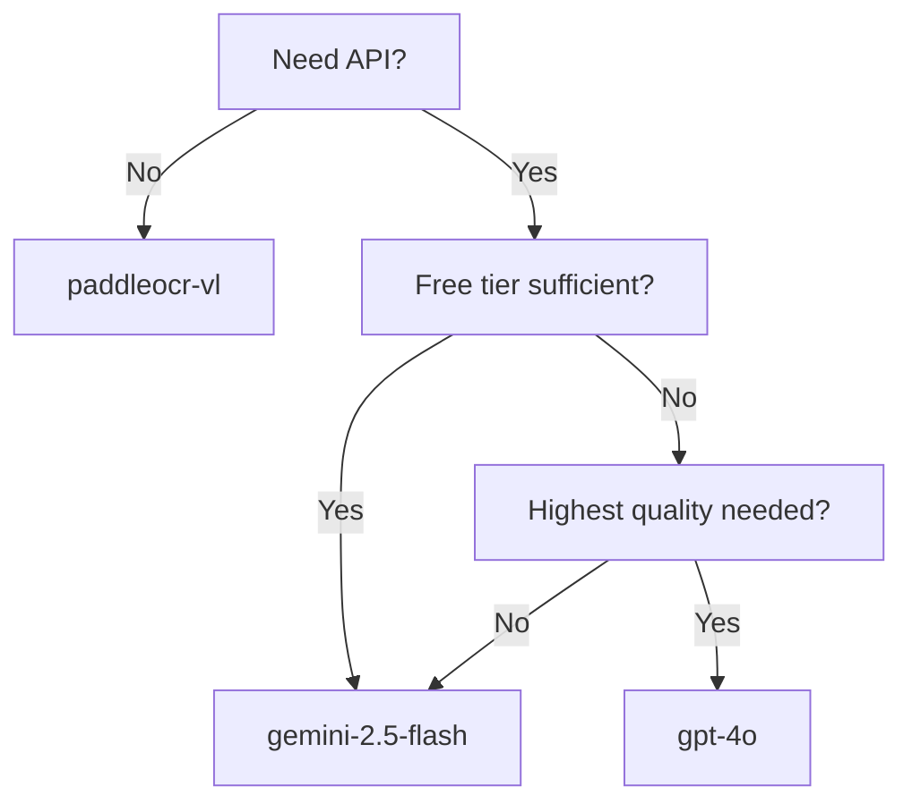

# Recognizers

Text recognition backends for extracting text from detected blocks.

## Overview

Recognizers extract text from detected layout blocks using Vision Language Models (VLMs). The pipeline supports both cloud APIs and local models.

## Recognizer Comparison

### Cloud VLM APIs

| Recognizer | Provider | Speed | Cost | Quality |
|------------|----------|-------|------|---------|
| `gemini-2.5-flash` | Google | Fast | Free tier | ⭐⭐⭐⭐ |
| `gemini-2.0-flash` | Google | Fast | Free tier | ⭐⭐⭐⭐ |
| `gpt-4o` | OpenAI | Medium | Pay per token | ⭐⭐⭐⭐⭐ |
| `gpt-4-turbo` | OpenAI | Medium | Pay per token | ⭐⭐⭐⭐⭐ |

### Local Models

| Recognizer | Parameters | Languages | Speed | Quality |
|------------|------------|-----------|-------|---------|
| `paddleocr-vl` | 0.9B | 109 | Medium | ⭐⭐⭐⭐ |
| `deepseek-ocr` | - | Multi | Medium | ⭐⭐⭐ |

---

## Gemini (Google)

**Type**: Cloud API | **Cost**: Free tier available

Google's Gemini Vision models for text extraction.

### Models

| Model | Speed | Context | Best For |
|-------|-------|---------|----------|
| `gemini-2.5-flash` | Fast | 1M tokens | General use, recommended |
| `gemini-2.0-flash` | Fast | 1M tokens | Alternative |

### Rate Limits (Free Tier)

| Limit | Value |
|-------|-------|
| Requests per minute | 15 |
| Tokens per minute | 1,500,000 |
| Requests per day | 1,500 |

### Usage

```python
from pipeline.recognition import TextRecognizer

recognizer = TextRecognizer(
    backend="gemini",
    model="gemini-2.5-flash",
    gemini_tier="free",  # free, tier1, tier2, tier3
)
```

### CLI

```bash
export GEMINI_API_KEY="your_api_key"
python main.py --input doc.pdf --recognizer gemini-2.5-flash --gemini-tier free
```

### Check Rate Limit Status

```bash
python main.py --rate-limit-status --recognizer gemini-2.5-flash --gemini-tier free
```

---

## OpenAI

**Type**: Cloud API | **Cost**: Pay per token

OpenAI's GPT-4 Vision models for high-quality text extraction.

### Models

| Model | Speed | Context | Best For |
|-------|-------|---------|----------|
| `gpt-4o` | Medium | 128K tokens | High quality |
| `gpt-4-turbo` | Medium | 128K tokens | Alternative |
| `gpt-4o-mini` | Fast | 128K tokens | Cost-effective |

### Usage

```python
recognizer = TextRecognizer(
    backend="openai",
    model="gpt-4o",
)
```

### CLI

```bash
export OPENAI_API_KEY="your_api_key"
python main.py --input doc.pdf --recognizer gpt-4o
```

---

## OpenRouter

**Type**: Cloud API | **Cost**: Varies by model

Access multiple VLMs through OpenRouter's unified API.

### Usage

```python
recognizer = TextRecognizer(
    backend="openai",  # Uses OpenAI-compatible API
    model="meta-llama/Llama-3-8b",
)
```

### CLI

```bash
export OPENROUTER_API_KEY="your_api_key"
python main.py --input doc.pdf --recognizer meta-llama/Llama-3-8b
```

---

## PaddleOCR-VL

**Type**: Local Model | **Cost**: Free

PaddleOCR-VL-0.9B is a 0.9B parameter Vision Language Model supporting 109 languages.

### Architecture

- **Vision Encoder**: NaViT (Native resolution Vision Transformer)
- **Language Model**: ERNIE-4.5-0.3B
- **Total Parameters**: 0.9B

### Language Support

109 languages including:
- CJK: Chinese, Japanese, Korean
- European: English, French, German, Spanish, Italian, Portuguese
- Middle Eastern: Arabic, Hebrew, Persian
- Indian: Hindi, Bengali, Tamil, Telugu
- Southeast Asian: Thai, Vietnamese, Indonesian
- And many more...

### Backend Options

| Backend | Speed | Memory | Notes |
|---------|-------|--------|-------|
| `pytorch` | Slow | ~4GB | Default |
| `vllm` | Fast | ~6GB | Recommended |
| `sglang` | Fast | ~6GB | Alternative |

### Usage

```python
recognizer = TextRecognizer(
    backend="paddleocr-vl",
    recognizer_backend="vllm",  # pytorch, vllm, sglang
)
```

### CLI

```bash
python main.py --input doc.pdf \
    --recognizer paddleocr-vl \
    --recognizer-backend vllm
```

### Requirements

- PaddleX v3.3.1 (in `external/PaddleX/`)
- GPU with CUDA support (4GB+ VRAM)

---

## DeepSeek-OCR

**Type**: Local Model | **Cost**: Free

DeepSeek-OCR uses contextual optical compression for efficient text extraction.

### Backend Options

| Backend | Speed | Memory |
|---------|-------|--------|
| `hf` | Slow | ~4GB |
| `vllm` | Fast | ~6GB |

### Usage

```python
recognizer = TextRecognizer(
    backend="deepseek-ocr",
    recognizer_backend="hf",  # hf, vllm
)
```

### CLI

```bash
python main.py --input doc.pdf \
    --recognizer deepseek-ocr \
    --recognizer-backend vllm
```

### Requirements

- DeepSeek-OCR (in `external/DeepSeek-OCR/`)
- GPU with CUDA support

---

## Prompt Management

Recognizers use model-specific prompts stored in YAML files.

### Prompt Directory Structure

```
settings/prompts/
├── gemini/
│   ├── text_extraction.yaml
│   ├── content_analysis.yaml
│   └── text_correction.yaml
├── openai/
│   └── ...
├── paddleocr-vl/
│   └── ...
└── default/
    └── ...
```

### Automatic Selection

The pipeline automatically selects the appropriate prompt directory:

| Recognizer | Prompt Directory |
|------------|------------------|
| `gemini-*` | `settings/prompts/gemini/` |
| `gpt-*` | `settings/prompts/openai/` |
| `paddleocr-vl` | `settings/prompts/default/` |

### Custom Prompts

```bash
# Use custom prompt directory
python main.py --input doc.pdf --prompts-dir custom_prompts/
```

---

## Caching

The recognition stage uses content-based caching to avoid reprocessing identical content.

### How It Works

```python
# Cache key = hash(block_image + block_type + prompt)
cache_key = hashlib.sha256(
    block_image.tobytes() +
    block_type.encode() +
    prompt.encode()
).hexdigest()
```

### Configuration

```bash
# Enable caching (default)
python main.py --input doc.pdf --cache

# Disable caching
python main.py --input doc.pdf --no-cache
```

**Cache Location**: `.cache/` directory (configurable via `--cache-dir`)

---

## Choosing a Recognizer

### Recommended Configurations

| Use Case | Recognizer | Reason |
|----------|------------|--------|
| **Free processing** | `gemini-2.5-flash` | Free tier, good quality |
| **Highest quality** | `gpt-4o` | Best understanding |
| **No API costs** | `paddleocr-vl` | Local, 109 languages |
| **Large batches** | `paddleocr-vl` + vLLM | Fast local inference |
| **Multi-language** | `paddleocr-vl` | 109 language support |

### Decision Matrix



---

## Performance Benchmarks

Tested on single page with 20 blocks:

| Recognizer | Time/Page | Cost/Page | Quality |
|------------|-----------|-----------|---------|
| `gemini-2.5-flash` | ~3s | Free | 95% |
| `gpt-4o` | ~5s | ~$0.02 | 98% |
| `paddleocr-vl` (pytorch) | ~10s | Free | 92% |
| `paddleocr-vl` (vllm) | ~3s | Free | 92% |

---

## See Also

- [Recognition API](../api/recognition.md) - API reference
- [Pipeline Stages](pipeline-stages.md) - Stage 4 details
- [Basic Usage](../getting-started/basic-usage.md) - Usage examples
