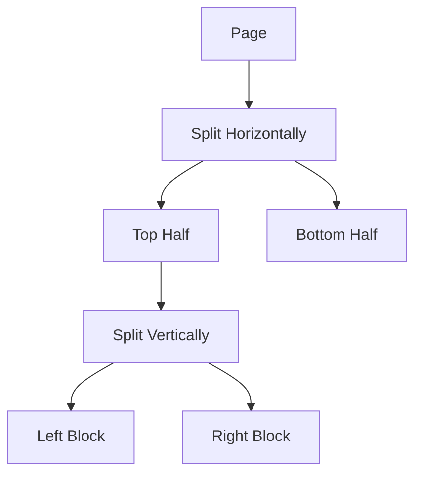
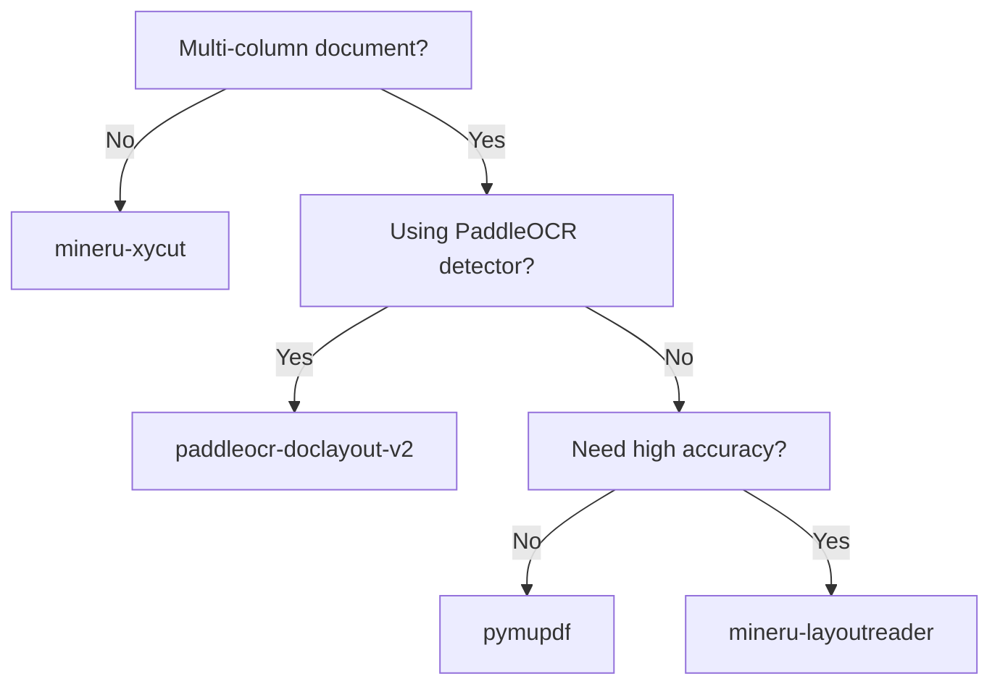

# Sorters

Reading order analysis algorithms for document layout.

## Overview

Sorters analyze the reading order of detected blocks, determining the sequence in which text should be read. This is crucial for multi-column documents and complex layouts.

## Sorter Comparison

| Sorter | Algorithm | Multi-Column | Speed | Quality |
|--------|-----------|--------------|-------|---------|
| `pymupdf` | Font analysis | ✅ | ⚡⚡⚡ | ⭐⭐⭐ |
| `mineru-xycut` | XY-Cut | ❌ | ⚡⚡⚡ | ⭐⭐ |
| `mineru-layoutreader` | LayoutLMv3 | ✅ | ⚡⚡ | ⭐⭐⭐⭐ |
| `mineru-vlm` | VLM reasoning | ✅ | ⚡ | ⭐⭐⭐⭐ |
| `olmocr-vlm` | VLM reasoning | ✅ | ⚡ | ⭐⭐⭐⭐ |
| `paddleocr-doclayout-v2` | Pointer network | ✅ | ⚡⚡ | ⭐⭐⭐⭐ |

---

## PyMuPDF Sorter

**Algorithm**: Font-based column analysis | **Speed**: Fast

Multi-column aware sorter using PyMuPDF's font and position analysis.

### How It Works

1. Analyzes font sizes and positions in the original PDF
2. Detects column boundaries based on text block positions
3. Groups blocks by column
4. Sorts within each column (top-to-bottom)
5. Assigns `column_index` to each block

### Output Fields

| Field | Description |
|-------|-------------|
| `order` | Global reading order (0-indexed) |
| `column_index` | Column assignment (0 = left, 1 = right, etc.) |

### Usage

```python
from pipeline.layout.ordering import create_sorter

sorter = create_sorter("pymupdf")
sorted_blocks = sorter.sort(blocks, image, pymupdf_page=page)
```

### CLI

```bash
python main.py --input doc.pdf --sorter pymupdf
```

### Best For

- Standard multi-column documents (newspapers, journals)
- Documents with consistent column layouts

---

## XY-Cut Sorter (MinerU)

**Algorithm**: Recursive XY-Cut | **Speed**: Fast

Classic recursive XY-Cut algorithm that divides the page into regions.

### How It Works

```
1. Find horizontal whitespace → split into rows
2. Find vertical whitespace → split into columns
3. Recursively apply until blocks are isolated
4. Order blocks by position
```



### Output Fields

| Field | Description |
|-------|-------------|
| `order` | Reading order (0-indexed) |

### Usage

```python
sorter = create_sorter("mineru-xycut")
sorted_blocks = sorter.sort(blocks, image)
```

### CLI

```bash
python main.py --input doc.pdf --sorter mineru-xycut
```

### Best For

- Simple layouts with clear horizontal/vertical separations
- Single-column documents
- Fast processing requirements

### Limitations

- May fail on complex multi-column layouts
- No column detection

---

## LayoutReader Sorter (MinerU)

**Algorithm**: LayoutLMv3 | **Speed**: Medium

Machine learning-based sorter using LayoutLMv3 for reading order prediction.

### How It Works

1. Encodes block positions and types
2. Uses LayoutLMv3 transformer to predict pairwise ordering
3. Constructs global order from pairwise comparisons

### Output Fields

| Field | Description |
|-------|-------------|
| `order` | ML-predicted reading order |

### Usage

```python
sorter = create_sorter("mineru-layoutreader")
sorted_blocks = sorter.sort(blocks, image)
```

### CLI

```bash
python main.py --input doc.pdf --sorter mineru-layoutreader
```

### Requirements

- MinerU 2.5+ (in `external/MinerU/`)
- ~2GB GPU memory

### Best For

- Complex layouts
- Academic papers
- Multi-column with figures/tables

---

## VLM Sorters

### MinerU VLM Sorter

**Algorithm**: Vision Language Model | **Speed**: Slow

Uses MinerU's VLM for visual reasoning about reading order.

!!! warning "Coupling Requirement"
    The `mineru-vlm` sorter requires the `mineru-vlm` detector. They share the same VLM inference.

```python
sorter = create_sorter("mineru-vlm")
# Requires mineru-vlm detector
```

### olmOCR VLM Sorter

**Algorithm**: Vision Language Model | **Speed**: Slow

Uses olmOCR's VLM for reading order analysis. More flexible than MinerU VLM.

```python
sorter = create_sorter("olmocr-vlm")
sorted_blocks = sorter.sort(blocks, image)
```

### CLI

```bash
python main.py --input doc.pdf --sorter olmocr-vlm --sorter-backend vllm
```

### Best For

- Very complex layouts
- Documents with unusual reading patterns
- When accuracy is more important than speed

---

## PaddleOCR DocLayoutV2 Sorter

**Algorithm**: Pointer Network | **Speed**: Medium

Preserves the reading order from PaddleOCR's PP-DocLayoutV2 detector, which includes a built-in pointer network for ordering.

### How It Works

- PP-DocLayoutV2 detector outputs blocks with order information
- Sorter preserves this ordering (passthrough)
- No additional computation required

### Usage

```python
# Best used with paddleocr-doclayout-v2 detector
sorter = create_sorter("paddleocr-doclayout-v2")
```

### CLI

```bash
python main.py --input doc.pdf \
    --detector paddleocr-doclayout-v2 \
    --sorter paddleocr-doclayout-v2
```

### Best For

- When using PaddleOCR PP-DocLayoutV2 detector
- Efficient processing (no separate sorting step)

---

## Detector/Sorter Compatibility

| Detector | Compatible Sorters |
|----------|-------------------|
| `doclayout-yolo` | All except `mineru-vlm` |
| `mineru-doclayout-yolo` | All except `mineru-vlm` |
| `paddleocr-doclayout-v2` | All |
| `mineru-vlm` | `mineru-vlm` only |

```bash
# Validate compatibility
from pipeline.layout.ordering import validate_combination

validate_combination("doclayout-yolo", "mineru-xycut")  # OK
validate_combination("doclayout-yolo", "mineru-vlm")    # Raises error
```

---

## Choosing a Sorter

### Recommended Configurations

| Use Case | Sorter | Reason |
|----------|--------|--------|
| **Fast processing** | `mineru-xycut` | Fastest, simple algorithm |
| **Multi-column docs** | `pymupdf` | Good column detection |
| **Complex layouts** | `mineru-layoutreader` | ML-based, accurate |
| **PaddleOCR pipeline** | `paddleocr-doclayout-v2` | Built-in ordering |
| **Maximum accuracy** | `olmocr-vlm` | VLM reasoning |

### Decision Matrix



---

## Performance Benchmarks

Tested on NVIDIA RTX 3090:

| Sorter | Blocks/sec | Accuracy | Notes |
|--------|------------|----------|-------|
| `mineru-xycut` | ~1000 | 85% | Fastest |
| `pymupdf` | ~500 | 90% | Good for columns |
| `paddleocr-doclayout-v2` | ~300 | 92% | With PP-DocLayoutV2 |
| `mineru-layoutreader` | ~100 | 95% | ML-based |
| `olmocr-vlm` | ~20 | 97% | VLM-based |

---

## See Also

- [Ordering API](../api/ordering.md) - API reference
- [Detectors](detectors.md) - Layout detection models
- [Architecture Overview](overview.md) - Pipeline design
