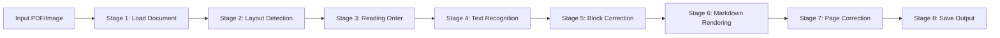

# VLM OCR Pipeline

A modular document processing system that combines layout detection (DocLayout-YOLO, MinerU, olmOCR, PaddleOCR) with Vision Language Models (OpenAI, Gemini, PaddleOCR-VL) for intelligent text extraction and correction.

!!! info "Based On"
    This project is based on and modified from [Versatile-OCR-Program](https://github.com/ses4255/Versatile-OCR-Program)

## Key Features

### 🎯 Modular Architecture

- **Flexible Detector/Sorter Combinations**: Mix and match detectors (DocLayout-YOLO, PaddleOCR PP-DocLayoutV2, MinerU, olmOCR) with sorters (multi-column, LayoutReader, XY-Cut, VLM)
- **8-Stage Pipeline**: Document loading → Detection → Ordering → Recognition → Block correction → Rendering → Page correction → Output
- **Unified BBox System**: Integer-based bounding boxes (internal: xyxy, JSON: xywh) with automatic conversion between 6+ formats

### 🤖 Multiple Recognition Backends

- **Cloud VLM APIs**: OpenAI GPT-4 Vision, Gemini 2.5 Flash
- **Local VLM**: PaddleOCR-VL-0.9B (0.9B parameters, NaViT + ERNIE-4.5-0.3B)
- **109+ Languages**: Extensive multilingual support

### 📄 Advanced Document Understanding

- **Layout Detection**: Automatically detects text, tables, figures, equations, lists
- **Reading Order Analysis**: Multi-column detection, LayoutLMv3, XY-Cut, VLM-based ordering
- **Special Content Processing**: Enhanced analysis of tables and figures with structured output
- **AI-Powered Correction**: Intelligent text correction using VLMs

### ⚡ Performance & Efficiency

- **Intelligent Caching**: Content-based hashing to avoid reprocessing
- **Rate Limiting**: Automatic throttling for Gemini API (free/tier1/tier2/tier3)
- **Batch Processing**: Process entire directories of PDFs
- **Model-Specific Prompts**: YAML-based prompt templates for optimal results

## Quick Example

```bash
# Basic usage with Gemini
python main.py --input document.pdf --backend gemini

# Advanced: Custom detector + sorter + recognizer
python main.py --input doc.pdf \
    --detector paddleocr-doclayout-v2 \
    --sorter mineru-layoutreader \
    --recognizer paddleocr-vl

# Batch processing with page limits
python main.py --input pdfs/ --backend openai --max-pages 5
```

## Architecture Overview



Each stage is modular and can be configured independently:

- **Detection**: `doclayout-yolo`, `paddleocr-doclayout-v2`, `mineru-vlm`, `olmocr-vlm`
- **Ordering**: `pymupdf`, `mineru-layoutreader`, `mineru-xycut`, `mineru-vlm`, `olmocr-vlm`
- **Recognition**: `openai`, `gemini`, `paddleocr-vl`

## What's Next?

<div class="grid cards" markdown>

-   :material-download:{ .lg .middle } __Installation__

    ---

    Install VLM OCR Pipeline in minutes

    [:octicons-arrow-right-24: Getting started](getting-started/installation.md)

-   :material-book-open-variant:{ .lg .middle } __User Guides__

    ---

    Learn about BBox formats, detectors, and advanced usage

    [:octicons-arrow-right-24: User Guides](guides/bbox-formats.md)

-   :material-api:{ .lg .middle } __API Reference__

    ---

    Explore the complete API documentation

    [:octicons-arrow-right-24: API Reference](api/pipeline.md)

-   :material-file-code:{ .lg .middle } __Architecture__

    ---

    Deep dive into pipeline stages and design patterns

    [:octicons-arrow-right-24: Architecture](architecture/overview.md)

</div>

## Community

- **GitHub**: [NoUnique/vlm-ocr-pipeline](https://github.com/NoUnique/vlm-ocr-pipeline)
- **Issues**: [Report bugs or request features](https://github.com/NoUnique/vlm-ocr-pipeline/issues)
- **Contributing**: See our [Contributing Guide](guides/contributing.md)
